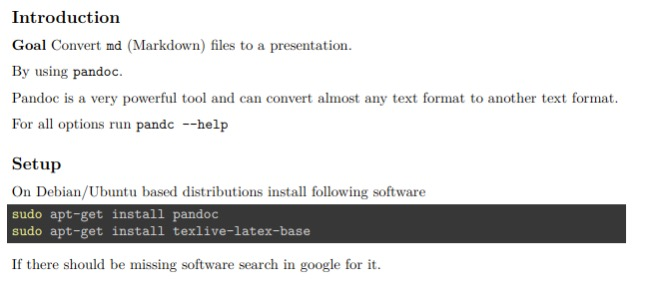
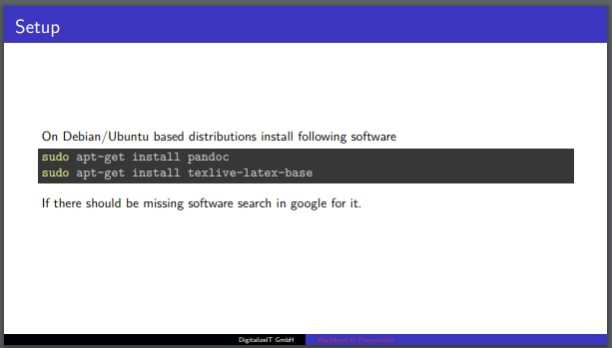

## Introduction

**Goal** Convert `md` (Markdown) files to a presentation.

By using `pandoc`.

Pandoc is a very powerful tool and can convert almost any text 
format to another text format.

For all options run `pandc --help` or checkout [Pandoc User's Guide](https://pandoc.org/MANUAL.html)

## Setup

On Debian/Ubuntu based distributions install following software

```bash
sudo apt-get install pandoc
sudo apt-get install texlive-latex-base
```

If there should be missing software search in google for it. 

## Basic

To simply convert an `md` file run:

```bash
pandoc README.md -t beamer -o presentation.pdf
```

## Advanced

To generate a more beautiful presentation add metadata. 

This can be done in the `md` file itself with a yaml block at the beginning

```bash
---
title:
- Mardown to Presentation
author:
- DigitalizeIT GmbH
theme:
- Copenhagen
---
```

```bash
pandoc howto.md -t beamer -o presentation.pdf
```

List with all [themes](https://deic-web.uab.cat/~iblanes/beamer_gallery/index_by_theme_and_color.html)

## Using a template file

Modify the `md` with specific pandoc metadata is not always what you want. We can put all these metadata to a template file. E.g. `template.yaml`.

```bash
pandoc README.md -t beamer -o presentation.pdf \
    --metadata-file=template.yaml
```

## Code block highlighting

There are several code highlighting styles available:
```bash
pandoc --list-highlight-styles
```

An example by using the `zenbrun` style
```bash
pandoc README.md -t beamer -o presentation.pdf \
    --metadata-file=template.yaml \
    --highlight-style=zenburn
```

## Generate other document types

There are almost 50 output formats available. To list them:

```bash
pandoc --list-output-formats
```

Be aware that every generator has it's own options. For example the `theme` option in the `template.yaml` is only available in the `beamer` generator. 

## Generate a PDF document

```bash
pandoc README.md -t latex -o presentation.pdf \
    --metadata-file=template.yaml \
    --highlight-style=zenburn -V geometry:a4paper
```

## Generate HTML
```bash
pandoc README.md -t html5 -o presentation.html \
    --metadata-file=template.yaml \
    --highlight-style=zenburn
```
If you analyze the generated HTML code all HTML tags have specific `class` attributes. So it's straight forward to generate a custom `css`.

## Generate Microsoft Office documents

Unfortunately `docx` and `pptx` have no templates available. 

### Generate a PowerPoint

```bash
pandoc README.md -t pptx -o presentation.pptx \
    --metadata-file=template.yaml \
    --highlight-style=zenburn
```

### Generate a word document

```bash
pandoc README.md -t docx -o presentation.docx \
    --metadata-file=template.yaml \
    --highlight-style=zenburn
```

## Conclusion

### Cons
Pandoc is in my opinion not a replacement for professional PowerPoint presentation or word documents. 

### Pro
Pandoc is a powerful tool to generate documents based out of Markdown files. Especial to document a software project. It can be easily integrated into a CI/CD pipeline and the documentation will be released at the same time as the software. 

### Hints
If you want to transform the Markdown be aware of it when writing. Especial the code snippets will not have a word wrap in the most cases. When generating a presentation (e.g. beamer). Be aware of the size of each slide...


## Results Document

Preview of the generated document



## Results Presentation

Preview of the generated presentation

